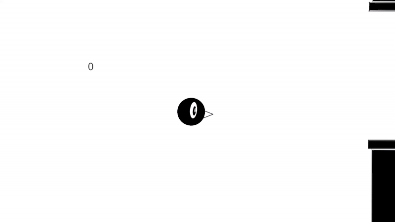

# Unity 1st Project (Flappy Bird Clone)

## Summary
Based on, and thanks to,  
**Game Maker's Toolkit - The Unity Tutorial For Complete Beginners.** 
https://www.youtube.com/watch?v=XtQMytORBmM&t=1044s 

With some personal sprites/scripts/modifications. 

## Log

### 18/02/2025
Game complete! 
Possible future add-ons:  
pause 
sound 
clouds/bg layer 
wings 
title screen 
save high score 
embed into webpage 

### 17/02/2025
Done: sprites, basic pipe generation, bounce animation  
Added minor bird rotation and collisions. 

### 17/02/2025
First upload
 

